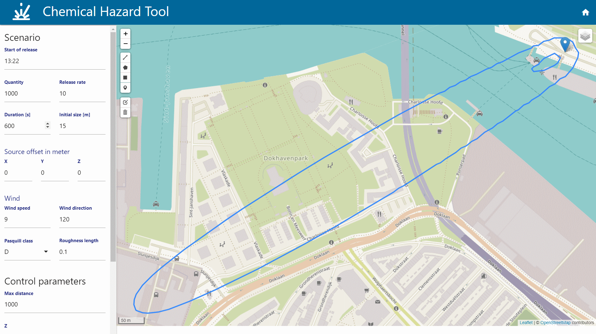

# Chemical Hazard Tool

A simple GUI and Kafka front-end to generate chemical hazard sources, and display its output.



## Installation

The application is a mono-repository, developed in TypeScript using [Nest.js](https://docs.nestjs.com) for the server, and [Mithril](https://mithril.js.org) for the GUI. It consists of the following packages:

- Server: to POST new chemical hazard sources to Kafka and GET chemical hazard clouds as GeoJSON from Kafka.
- GUI: to enter new source definitions and show the resulting cloud.
- Shared: shared models

The easiest way is to run the docker compose file in the `./docker` folder:

```bash
cd docker
docker-compose up -d
```

The GUI will then be available at [localhost:3333](http://localhost:3333/).  
Refer to the [README](./docker/README.md) file in the `docker` folder for more information on what all the different services do.

## Development

To run the node parts of this repository separately (i.e. without the Kafka infrastructure) you can run:

```bash
# If you don't have pnpm installed, you can install it using `npm i -g pnpm`
pnpm multi install
npm start
```

This installs the npm packages, their dependencies and then starts the server, gui and shared applications.

If you want to have the underlying Kafka infrastructure you need to run the `docker-compose` command above, **but first comment out the chemical_hazard_tool service such that docker does not start it in parllel to npm**.
Otherwise the chemical hazard tool is started twice (once as a docker image, once by `npm`) which creates port conflicts and confusing issues.

Assuming the project is running using `npm start`, you can access:

- The GUI at [http://localhost:1234](http://localhost:1234).
- OpenAPI (Swagger) interface at [http://localhost:3333/api](http://localhost:3333/api).
- OpenAPI configuration file at [http://localhost:3333/api-json](http://localhost:3333/api-json).
- The server at [http://localhost:3333](http://localhost:3333)

## Schemas

The chemical hazard source is defined in `packages/server/schemas/cbrn/chemical_hazard.avsc`.
You can run `npm run convert` to update the TypeScript interface definition.
